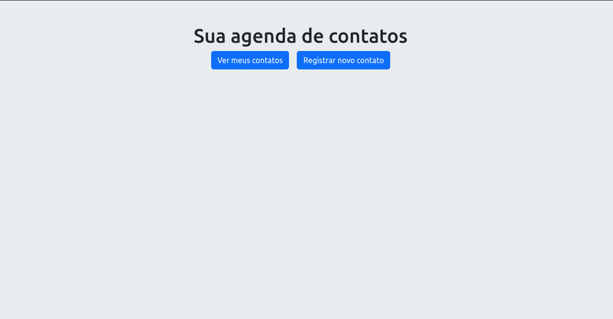
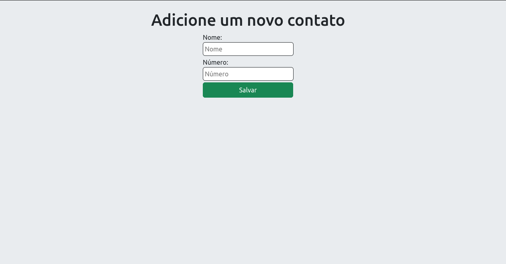
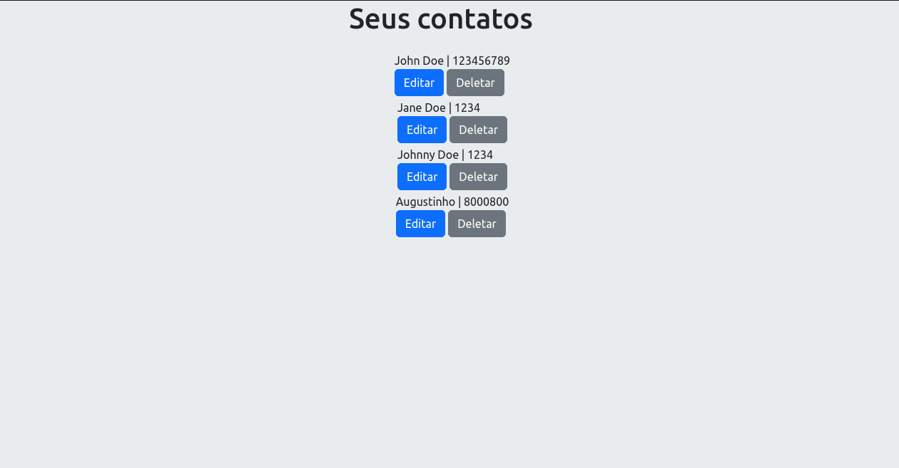
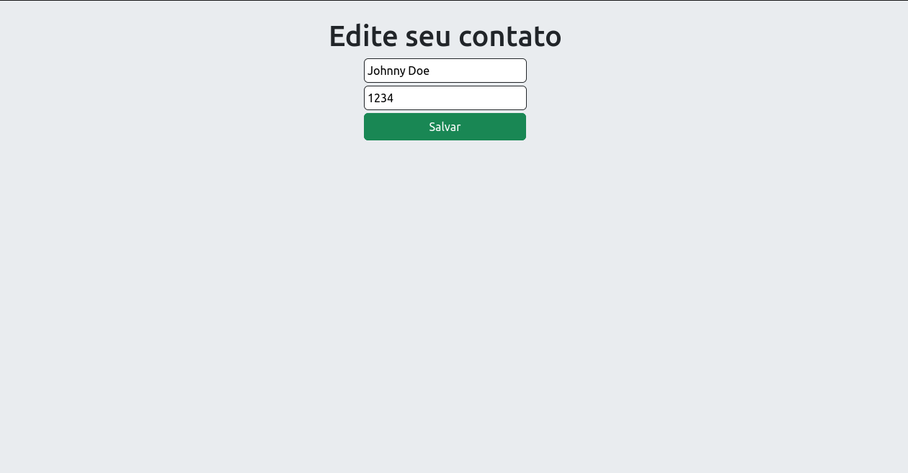

# contact-book

É um projeto frontend construido por mim do zero, que completa uma aplicação fullstack junto ao projeto [register-contact-api](https://github.com/DevVitorSilva/register-contact-api) onde se é possivel ver contatos, editar, adicionar novo e deletar um contato.

## Imagens do projeto



- Está é a tela inicial, onde você poderá registrar um novo contato ou ver seus contatos já registrados.



- Para registrar um novo contato basta inserir o nome e número nos inputs, após apertar em salvar você será redireciona para a página onde se encontra todos os contatos, lá verá o contato que você adicionou.



- Página onde se encontra todos os contatos já registrados.



- Para editar um novo contato basta fazer alterações nas informações que estão nos inputs, logo após clicar em salvar.

- Para deletar um contato basta ir em 'ver meus contatos' e apertar o botão deletar na cor cinza.

## Tecnologias utilizadas

- HTML
- Javascript
- Bootstrap

## Conceitos utilizados

- FetchAPI do Javascript
- Async/await
- Trabalhando com promisses
- Deletar elemento da raiz html

## Como executar o projeto

Pré-requisitos:

- Visual Studio Code (editor de código)
- Live Server (extensão do Visual Studio Code)

```bash
#clonar repositório
git clone https://github.com/DevVitorSilva/contact-book.git
```

- Abrir pasta do projeto no Visual Studio Code
- Procure o arquivo index.html
- Clique com o botão direito do mouse em cima dele e escolha a opção 'Open with Live Server' ou 'Abrir com Live Server'
- O Live Server abrirá uma aba do navegador com o projeto rodando na sua máquina local

## Autor

Vitor Silva

[Linkedin](https://linkedin.com/in/vitor-silva-a289a9288)
